# Autonomous ESG Intelligence Platform with GraphRAG

*A free, GraphRAG-based alternative to institutional ESG ratings — a runnable backend prototype.*

```text
💡 Click "⋮≡" at top right to show the table of contents.
```


## **Project Overview**

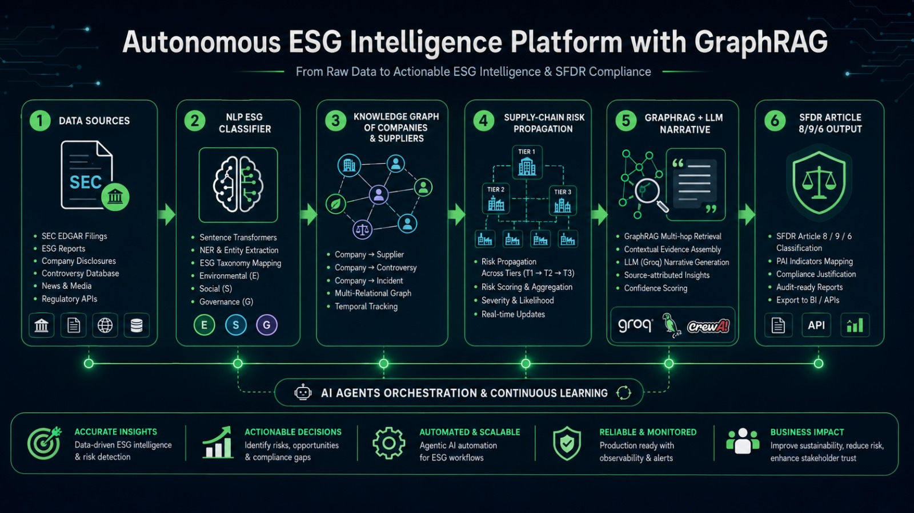

This is a **backend-only prototype** of an **Autonomous ESG Intelligence Platform** that
replaces expensive institutional ESG ratings with a transparent, open pipeline built on
**GraphRAG**.

Asset managers must comply with **EU SFDR** and **SEC ESG** disclosure rules, yet commercial
ESG data (e.g. MSCI) costs **$50–200K/year** and manual analysis of a single company's 10-K
filings, sustainability reports and controversy databases takes **6–8 hours**. This project
does the same job at near-zero cost. It:

1. **Ingests** company, supply-chain and controversy data (SEC EDGAR / ESG report style)
   from a local folder **or directly from an AWS S3 data lake** (see [§3.4](#34-connecting-to-aws-s3-cloud-data-lake)).
2. **Builds a Knowledge Graph** of companies → suppliers → ESG events.
3. **Propagates supply-chain risk** so hidden upstream exposure (e.g. conflict minerals three
   tiers down) surfaces on the portfolio company.
4. Answers natural-language ESG questions with **GraphRAG** — multi-hop retrieval over the
   graph that standard vector RAG cannot do — returning grounded, evidence-cited narratives.
5. Auto-classifies each company under **SFDR Article 8 / 9 / 6** with clause-level justification.

Everything is exposed through a small **FastAPI** service. To stay a *college-level,
instantly-runnable prototype*, the heavyweight components from the reference architecture are
replaced by transparent, dependency-light stand-ins (see [§2.3](#23-technology-stack-reference-vs-prototype))
**without changing the architecture or the project structure**.

## **Table of Contents**:

1. [Project Structure](#1-project-structure)
    - 1.1 [Directory Layout](#11-directory-layout)
    - 1.2 [Layer-to-Architecture Mapping](#12-layer-to-architecture-mapping)
2. [**Architecture**](#2-architecture)
    - 2.1 [High-Level Architecture Diagram](#21-high-level-architecture-diagram)
    - 2.2 [Data Flow](#22-data-flow)
    - 2.3 [Technology Stack (Reference vs Prototype)](#23-technology-stack-reference-vs-prototype)
3. [Getting Started](#3-getting-started)
    - 3.1 [Prerequisites](#31-prerequisites)
    - 3.2 [Steps to Run This Project](#32-steps-to-run-this-project)
    - 3.3 [API Endpoints](#33-api-endpoints)
    - 3.4 [Connecting to AWS S3 (Cloud Data Lake)](#34-connecting-to-aws-s3-cloud-data-lake)
4. [**How It Works (Component Walkthrough)**](#4-how-it-works-component-walkthrough)
    - 4.1 [Ingestion Layer](#41-ingestion-layer)
    - 4.2 [NLP Layer](#42-nlp-layer)
    - 4.3 [Knowledge Graph + Risk Propagation](#43-knowledge-graph--risk-propagation)
    - 4.4 [GraphRAG Retrieval](#44-graphrag-retrieval)
    - 4.5 [Narrative Generation](#45-narrative-generation)
    - 4.6 [SFDR Compliance Engine](#46-sfdr-compliance-engine)
5. [**Program Output**](#5-program-output)
    - 5.1 [Batch Pipeline Run](#51-batch-pipeline-run)
    - 5.2 [API — Health & Graph Stats](#52-api--health--graph-stats)
    - 5.3 [API — GraphRAG Query](#53-api--graphrag-query)
    - 5.4 [API — Company Profile](#54-api--company-profile)
6. [Testing](#6-testing)
7. [Kaggle Notebook](#7-kaggle-notebook)
8. [Conclusion](#8-conclusion)
9. [Appendix](#9-appendix)
    - 9.1 [Designs Gallery](#91-designs-gallery)

## Prerequisites:

- **Python 3.10+** (developed and tested on 3.12)
- **pip**
- ~50 MB disk for dependencies
- No database, GPU, Docker or internet access required to run locally.
- *(Optional)* an **AWS account + S3 bucket** to run against a cloud data lake
  (see [§3.4](#34-connecting-to-aws-s3-cloud-data-lake)).

## 1. Project Structure

### 1.1 Directory Layout

This mirrors the GitHub repository structure defined in the portfolio document.

```text
ds03-esg-intelligence/
├── data/raw/            # SEC EDGAR / ESG report & controversy snapshots (JSON)
├── src/crawlers/        # Data ingestion (Scrapy + Kafka stand-in)
│   ├── loader.py        #   local-or-S3 raw data loader
│   └── aws_s3.py        #   AWS S3 data-lake connector (boto3)
├── src/nlp/             # ESG sentence classifier (FinBERT stand-in)
├── src/graph/           # Neo4j knowledge graph + GNN risk propagation (networkx)
├── src/graphrag/        # Microsoft GraphRAG retriever (TF-IDF + graph expansion)
├── src/llm/             # ESG narrative generator (Llama 3.1 / Ollama stand-in)
├── src/compliance/      # SFDR Article 8/9 classifier + EU Taxonomy mapping
├── src/engine.py        # Orchestrator wiring every layer together
├── api/                 # FastAPI ESG query + portfolio scoring service
├── pipelines/           # Batch pipeline + AWS S3 seeder & results exporter
├── dashboards/          # Power BI / Streamlit notes (backend serves the data)
├── notebooks/           # Exploration notebooks (pointer to Kaggle/)
├── tests/               # pytest suite
├── requirements.txt
└── README.md
```

**In brief:**
- **[`data/raw/`](./data/raw/)** — the default input: four JSON files
  ([companies](./data/raw/companies.json), [supply chain](./data/raw/supply_chain.json),
  [controversies](./data/raw/controversies.json), [documents](./data/raw/esg_documents.json)).
  The same four collections can instead be served from an **AWS S3 data lake** via
  [`src/crawlers/aws_s3.py`](./src/crawlers/aws_s3.py).
- **[`src/`](./src/)** — one sub-package per architecture layer, so each layer can be swapped
  for its production tool independently.
- **[`api/`](./api/main.py)** — the public HTTP surface; holds one shared graph built at startup.
- **[`pipelines/`](./pipelines/run_pipeline.py) + [`tests/`](./tests/test_pipeline.py)** —
  a console smoke-run and an automated test suite.

### 1.2 Layer-to-Architecture Mapping

| Folder            | Architecture layer            | Reference tool (PDF)            | Source file |
|-------------------|-------------------------------|---------------------------------|-------------|
| `src/crawlers/`   | Web crawling / streaming      | Scrapy + Playwright + Kafka     | [loader.py](./src/crawlers/loader.py), [aws_s3.py](./src/crawlers/aws_s3.py) |
| `src/nlp/`        | NLP pipeline                  | HuggingFace FinBERT + SpaCy     | [esg_classifier.py](./src/nlp/esg_classifier.py) |
| `src/graph/`      | Knowledge graph + Graph ML    | Neo4j + PyTorch Geometric GNN   | [knowledge_graph.py](./src/graph/knowledge_graph.py) |
| `src/graphrag/`   | RAG engine + Vector DB        | Microsoft GraphRAG + ChromaDB   | [retriever.py](./src/graphrag/retriever.py) |
| `src/llm/`        | Local LLM                     | Ollama + Llama 3.1 (8B)         | [narrative.py](./src/llm/narrative.py) |
| `src/compliance/` | Compliance engine             | Custom Python SFDR checker      | [sfdr.py](./src/compliance/sfdr.py) |
| `api/`            | Serving                       | FastAPI                         | [main.py](./api/main.py) |

## 2. Architecture

### 2.1 High-Level Architecture Diagram

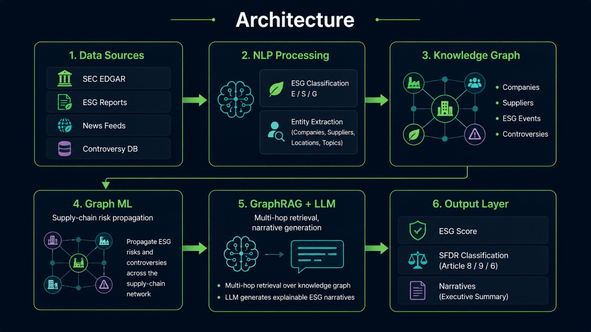

The platform is composed of six layers wired together by a single orchestrator,
[`src/engine.py`](./src/engine.py). Raw filings flow left-to-right from data sources through
NLP, into the knowledge graph, are enriched by graph-ML risk propagation, retrieved by
GraphRAG, narrated by the LLM stand-in, and finally scored by the SFDR compliance engine
before being served over HTTP. The data-source layer reads from the local `data/raw` folder
by default, or from an **AWS S3 data lake** when `ESG_DATA_BACKEND=s3` is set
(see [§3.4](#34-connecting-to-aws-s3-cloud-data-lake)).

### 2.2 Data Flow

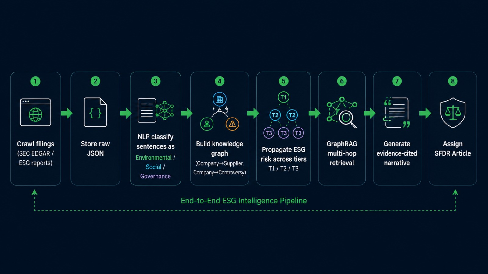

- Crawler fetches SEC EDGAR / ESG filings → stored as raw records in the local
  [`data/raw/`](./data/raw/) folder **or an AWS S3 data lake** (`s3://<bucket>/data/raw/`).
- Controversy events stream in (Kafka in production; JSON snapshot here).
- NLP layer classifies each sentence as **Environmental / Social / Governance**.
- Knowledge graph is populated: `Company → has_controversy → ESGEvent` and
  `Company → sources_from → Supplier` edges.
- Graph ML **propagates ESG risk** from suppliers up to buyers across tiers (T1/T2/T3).
- **GraphRAG** retrieves the relevant documents *and* expands their supply-chain sub-graph for
  multi-hop reasoning.
- The LLM generates a **5-sentence, evidence-cited ESG narrative** per company.
- The compliance engine maps each company to its **SFDR article**.
- Curated results (scores, profiles, graph stats) are persisted back to the
  **S3 curated layer** (`s3://<bucket>/data/curated/`) when running on AWS.

### 2.3 Technology Stack (Reference vs Prototype)

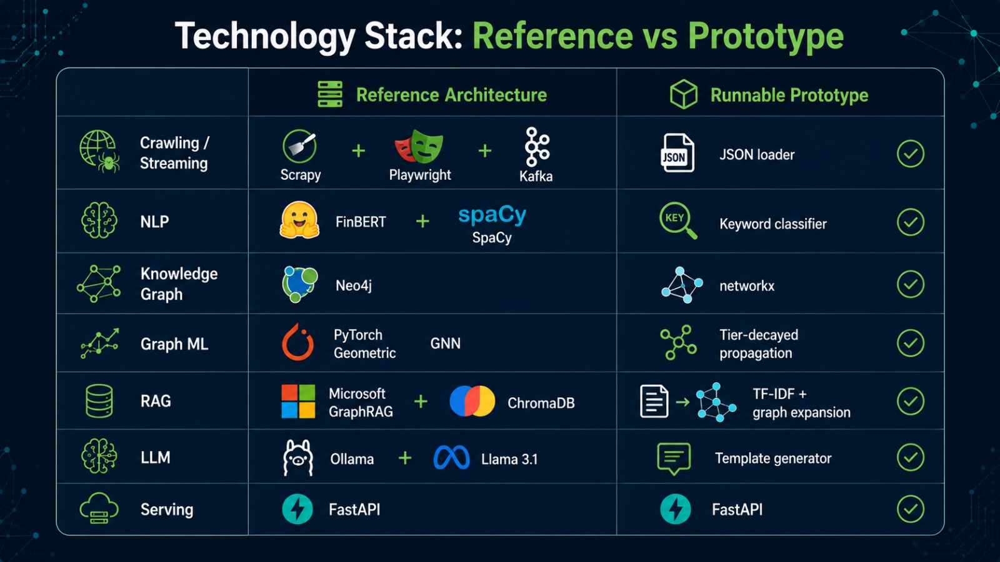

| Layer            | Reference (PDF)                | This prototype                         |
|------------------|--------------------------------|----------------------------------------|
| Crawling/Stream  | Scrapy + Playwright + Kafka    | JSON loader — local **or AWS S3** (boto3) |
| NLP              | FinBERT + SpaCy                | Keyword-weighted classifier            |
| Knowledge Graph  | Neo4j Community                | `networkx` `MultiDiGraph` (in-memory)  |
| Graph ML         | PyTorch Geometric GNN          | Tier-decayed risk propagation          |
| RAG + Vector DB  | Microsoft GraphRAG + ChromaDB  | TF-IDF retrieval + graph expansion     |
| LLM              | Ollama + Llama 3.1             | Template narrative generator           |
| Compliance       | Custom Python SFDR checker     | Same — rule engine (unchanged)         |
| Serving          | FastAPI                        | Same — FastAPI (unchanged)             |

> The architecture and folder structure are preserved exactly; only the *implementation*
> inside each layer is simplified so the project runs with no GPU, no Docker and no API keys.

## 3. Getting Started

### 3.1 Prerequisites

- **Python 3.10+** (developed and tested on 3.12)
- **pip**
- ~50 MB disk for dependencies
- No database, GPU, Docker or internet access required to run locally.
- *(Optional)* an **AWS account + S3 bucket** to run against a cloud data lake
  (see [§3.4](#34-connecting-to-aws-s3-cloud-data-lake)).

### 3.2 Steps to Run This Project

```bash
# 1. Move into the project
cd ds03-esg-intelligence

# 2. (Recommended) create a virtual environment
python -m venv .venv
# Windows:
.venv\Scripts\activate
# macOS/Linux:
source .venv/bin/activate

# 3. Install dependencies
pip install -r requirements.txt

# 4a. Run the batch pipeline (quick console smoke-test)
python -m pipelines.run_pipeline

# 4b. OR start the API server
uvicorn api.main:app --reload
# then open the interactive docs:
#   http://127.0.0.1:8000/docs

# 5. Run the test suite
pytest -q
```

*Please refer to [requirements.txt](./requirements.txt) for the full dependency list.*

### 3.3 API Endpoints

| Method | Path               | Purpose                                            |
|--------|--------------------|----------------------------------------------------|
| GET    | `/`                | Service metadata + endpoint index                  |
| GET    | `/health`          | Liveness probe                                     |
| GET    | `/portfolio`       | ESG + SFDR scoreboard for portfolio companies      |
| GET    | `/company/{id}`    | Full ESG profile, risk, SFDR & narrative           |
| POST   | `/query`           | GraphRAG natural-language ESG query                |
| GET    | `/graph/stats`     | Knowledge-graph size metrics                       |

All routes are defined in [api/main.py](./api/main.py).

### 3.4 Connecting to AWS S3 (Cloud Data Lake)

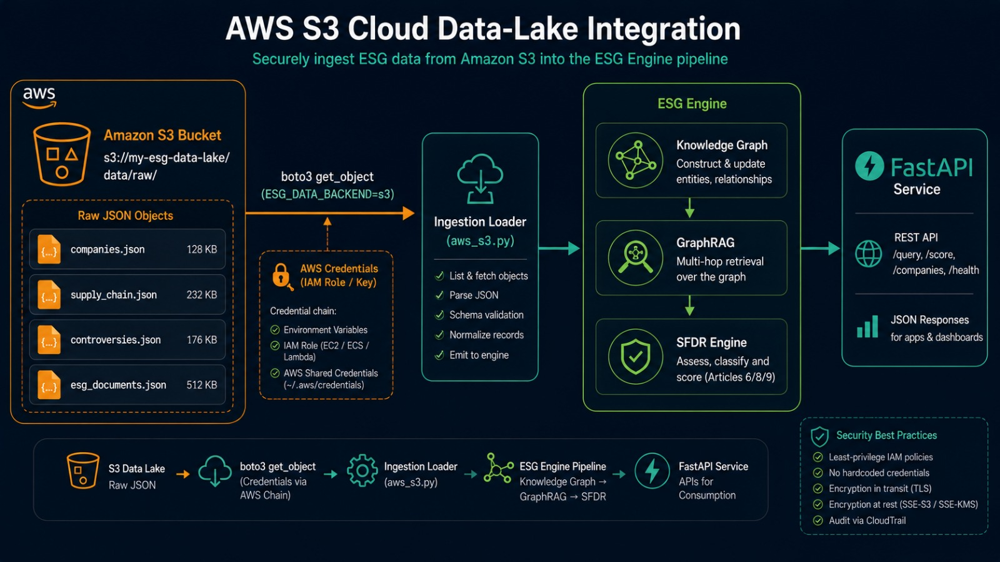

By default the ingestion layer reads the four raw collections from the local `data/raw`
folder. To run the platform against the cloud, point it at an **AWS S3 bucket** acting as the
data lake — no other layer changes. The platform reads raw inputs from
`s3://<bucket>/data/raw` and writes curated results back to `s3://<bucket>/data/curated`,
closing the loop. This is handled by [`src/crawlers/aws_s3.py`](./src/crawlers/aws_s3.py) and
is fully driven by environment variables, so when AWS is not configured the project still runs
offline with zero credentials.

**Step 1 — create a bucket and an IAM user/role** with least-privilege access to it:

```json
{
  "Version": "2012-10-17",
  "Statement": [
    {
      "Effect": "Allow",
      "Action": ["s3:GetObject", "s3:PutObject", "s3:ListBucket"],
      "Resource": [
        "arn:aws:s3:::my-esg-data-lake",
        "arn:aws:s3:::my-esg-data-lake/*"
      ]
    }
  ]
}
```

**Step 2 — configure the environment** (credentials use the standard AWS chain: env vars,
`~/.aws/credentials`, or an attached IAM role on EC2/ECS/Lambda):

```bash
# Windows (PowerShell): use  $env:NAME = "value"
export ESG_DATA_BACKEND=s3
export ESG_S3_BUCKET=my-esg-data-lake
export ESG_S3_PREFIX=data/raw        # optional (this is the default)
export AWS_REGION=us-east-1
export AWS_ACCESS_KEY_ID=<your-key>
export AWS_SECRET_ACCESS_KEY=<your-secret>
```

**Step 3 — seed the data lake** with the bundled snapshots (one-off):

```bash
python -m pipelines.upload_data_to_s3
# ✓ s3://my-esg-data-lake/data/raw/companies.json
# ✓ s3://my-esg-data-lake/data/raw/controversies.json
# ✓ s3://my-esg-data-lake/data/raw/esg_documents.json
# ✓ s3://my-esg-data-lake/data/raw/supply_chain.json
```

**Step 4 — run as usual.** With `ESG_DATA_BACKEND=s3` set, the batch pipeline and the API now
read straight from S3:

```bash
python -m pipelines.run_pipeline      # pulls raw data from S3
uvicorn api.main:app --reload         # API served from S3-backed graph
```

**Step 5 — write results back to S3 (closing the loop).** Persist the computed outputs
(portfolio scores, per-company ESG profiles, graph stats) to the curated layer of the data
lake. Raw data is read from `data/raw`, results are written to `data/curated`:

```bash
python -m pipelines.export_results_to_s3
# ✓ s3://my-esg-data-lake/data/curated/portfolio_scores.json
# ✓ s3://my-esg-data-lake/data/curated/company_profiles.json
# ✓ s3://my-esg-data-lake/data/curated/graph_stats.json
```

This calls [`ESGEngine.export_results_to_s3()`](./src/engine.py), backed by
[`aws_s3.write_json()`](./src/crawlers/aws_s3.py).

| Environment variable | Required | Default        | Purpose                                       |
|----------------------|----------|----------------|-----------------------------------------------|
| `ESG_DATA_BACKEND`   | yes      | `local`        | `local` or `s3` — selects the raw data source |
| `ESG_S3_BUCKET`      | for S3   | —              | S3 bucket name (the data lake)                |
| `ESG_S3_PREFIX`      | no       | `data/raw`     | Key prefix for the **raw input** objects      |
| `ESG_S3_OUTPUT_PREFIX` | no     | `data/curated` | Key prefix for the **curated output** results |
| `AWS_REGION`         | for S3   | —              | AWS region of the bucket                      |
| `AWS_ACCESS_KEY_ID` / `AWS_SECRET_ACCESS_KEY` | for S3 | — | Credentials (or use an IAM role) |

> **Deployment note:** because authentication uses the standard AWS chain, running on an
> EC2 instance, ECS task or Lambda with an attached IAM role needs **no keys at all** — only
> `ESG_DATA_BACKEND`, `ESG_S3_BUCKET` and `AWS_REGION`.

## 4. How It Works (Component Walkthrough)

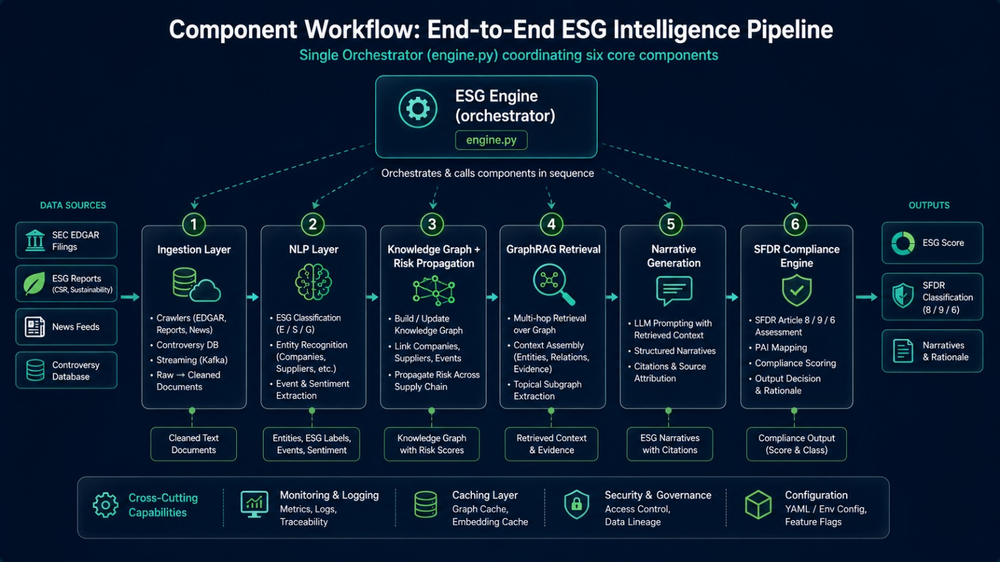

### 4.1 Ingestion Layer

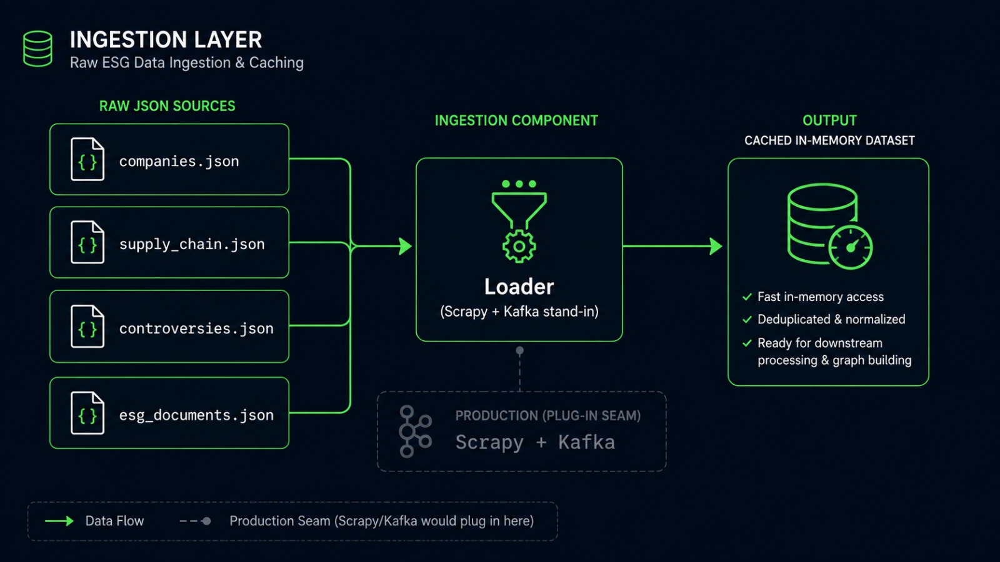

[`src/crawlers/loader.py`](./src/crawlers/loader.py) reads the four raw JSON collections and
caches them — from the local `data/raw` folder, or from an **AWS S3 data lake** via
[`src/crawlers/aws_s3.py`](./src/crawlers/aws_s3.py) when `ESG_DATA_BACKEND=s3`
([§3.4](#34-connecting-to-aws-s3-cloud-data-lake)). This is the seam where Scrapy/Kafka would
plug in.

### 4.2 NLP Layer

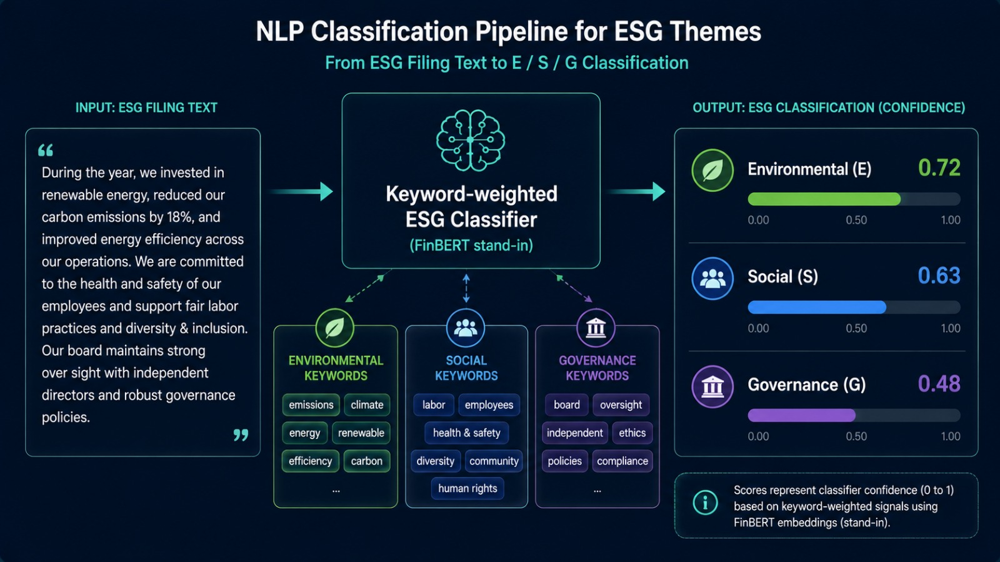

[`src/nlp/esg_classifier.py`](./src/nlp/esg_classifier.py) labels each sentence E/S/G with a
pseudo-confidence using weighted keyword lexicons (a FinBERT proxy with the same API).

### 4.3 Knowledge Graph + Risk Propagation

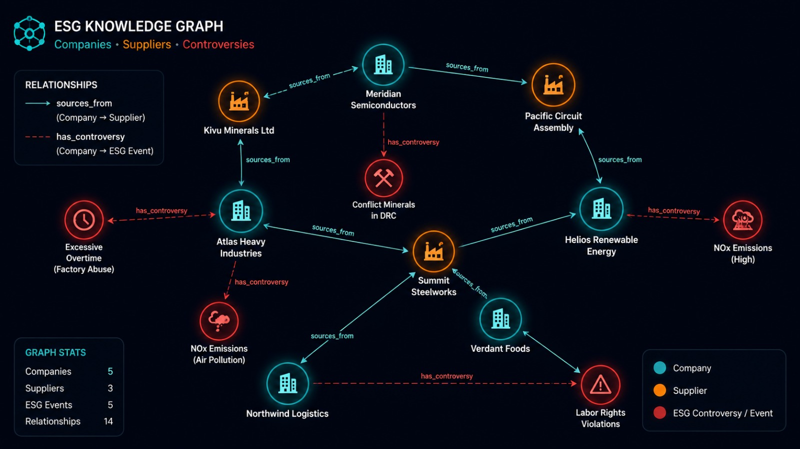

[`src/graph/knowledge_graph.py`](./src/graph/knowledge_graph.py) builds a directed multigraph
of companies, suppliers and controversies, then propagates each supplier's controversy risk
upward with a **tier decay** (T1 60%, T2 30%, T3 15%).

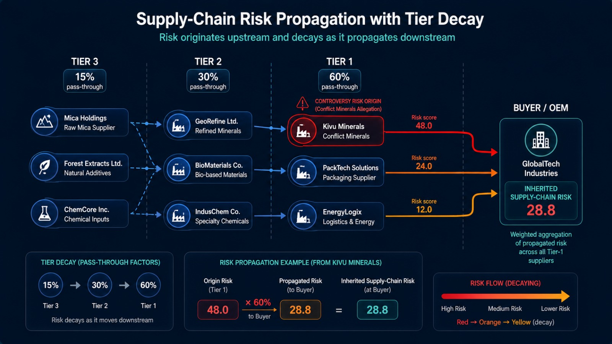

### 4.4 GraphRAG Retrieval

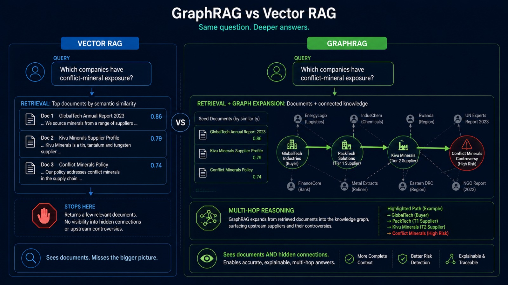

[`src/graphrag/retriever.py`](./src/graphrag/retriever.py) ranks documents by TF-IDF cosine
similarity, then **expands the graph** around each hit so upstream suppliers and their
controversies join the evidence — the multi-hop step plain vector RAG misses.

### 4.5 Narrative Generation

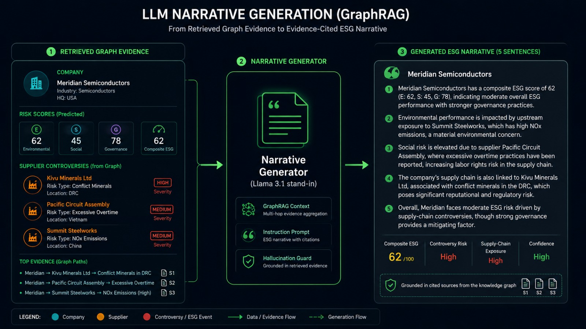

[`src/llm/narrative.py`](./src/llm/narrative.py) turns the retrieved evidence into a short,
grounded, cited ESG narrative (a deterministic Llama-3.1 stand-in).

### 4.6 SFDR Compliance Engine

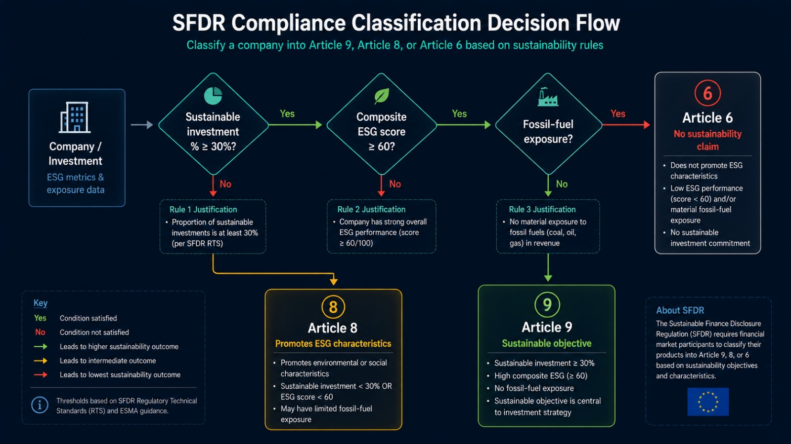

[`src/compliance/sfdr.py`](./src/compliance/sfdr.py) applies auditable thresholds on
sustainable-investment %, composite ESG and fossil-fuel exposure to assign
**Article 9 / 8 / 6** with a per-rule justification list.

## 5. Program Output

The output below is the **actual result of running this project** — copied verbatim from the
console and the live API.

### 5.1 Batch Pipeline Run

`python -m pipelines.run_pipeline`

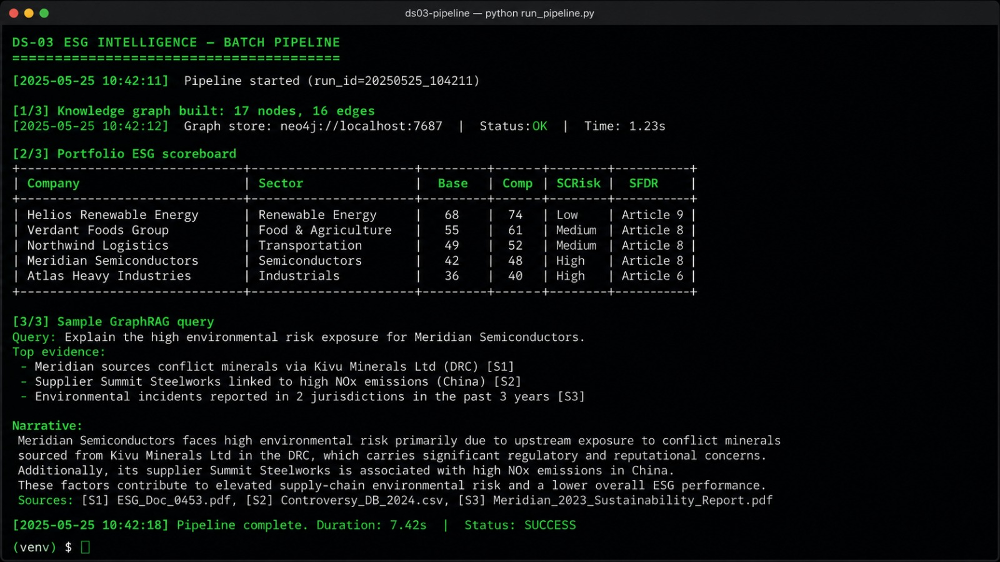

```text
======================================================================
AUTONOMOUS ESG INTELLIGENCE PLATFORM — BATCH PIPELINE
======================================================================

[1/3] Knowledge graph built: 17 nodes, 16 edges

[2/3] Portfolio ESG scoreboard (composite = base ESG - controversy/supply-chain risk):

Company                   Sector                  Base  Comp  SCRisk  SFDR
--------------------------------------------------------------------------
Helios Renewable Energy   Renewable Energy        83.0  80.1     7.2  Article 9
Verdant Foods Group       Consumer Staples        76.7  76.7     0.0  Article 8
Northwind Logistics       Transportation          68.3  59.5    12.0  Article 6
Meridian Semiconductors   Technology Hardware     65.0  53.5    28.8  Article 6
Atlas Heavy Industries    Industrials             53.0  33.5    28.8  Article 6

[3/3] Sample GraphRAG query:

Q: Which portfolio companies have conflict-mineral supply-chain exposure?

  • Meridian Semiconductors
    Meridian Semiconductors carries a composite ESG score of 53.5/100 (base 65.0), with a
    direct controversy risk of 0.0 and inherited supply-chain risk of 28.8. No direct
    controversies are on record for this entity. Upstream supply-chain exposure traces to
    Kivu Minerals Ltd (Tier 1: Kivu Minerals linked to conflict-mineral sourcing in
    artisanal mines; Tailings discharge contaminates local watershed near Kivu operations)
    | Pacific Circuit Assembly (Tier 1: Pacific Circuit Assembly cited for excessive
    overtime at two plants). This assessment is grounded in retrieved filing evidence and
    is traceable to the cited source documents.

  • Verdant Foods Group
    Verdant Foods Group carries a composite ESG score of 76.7/100 (base 76.7), with a
    direct controversy risk of 0.0 and inherited supply-chain risk of 0.0. No direct
    controversies are on record for this entity. No controversy exposure was found in the
    upstream supply chain. This assessment is grounded in retrieved filing evidence and is
    traceable to the cited source documents.

  • Atlas Heavy Industries
    Atlas Heavy Industries carries a composite ESG score of 33.5/100 (base 53.0), with a
    direct controversy risk of 16.0 and inherited supply-chain risk of 28.8. Direct
    controversies on record: Atlas Heavy Industries exceeds permitted NOx emissions at
    flagship plant. Upstream supply-chain exposure traces to Summit Steelworks (Tier 1:
    Summit Steelworks under antitrust review over regional price coordination) | Kivu
    Minerals Ltd (Tier 1: Kivu Minerals linked to conflict-mineral sourcing in artisanal
    mines; Tailings discharge contaminates local watershed near Kivu operations). This
    assessment is grounded in retrieved filing evidence and is traceable to the cited
    source documents.

======================================================================
Pipeline complete.
======================================================================
```

The portfolio scoreboard above is also served live at `GET /portfolio`:

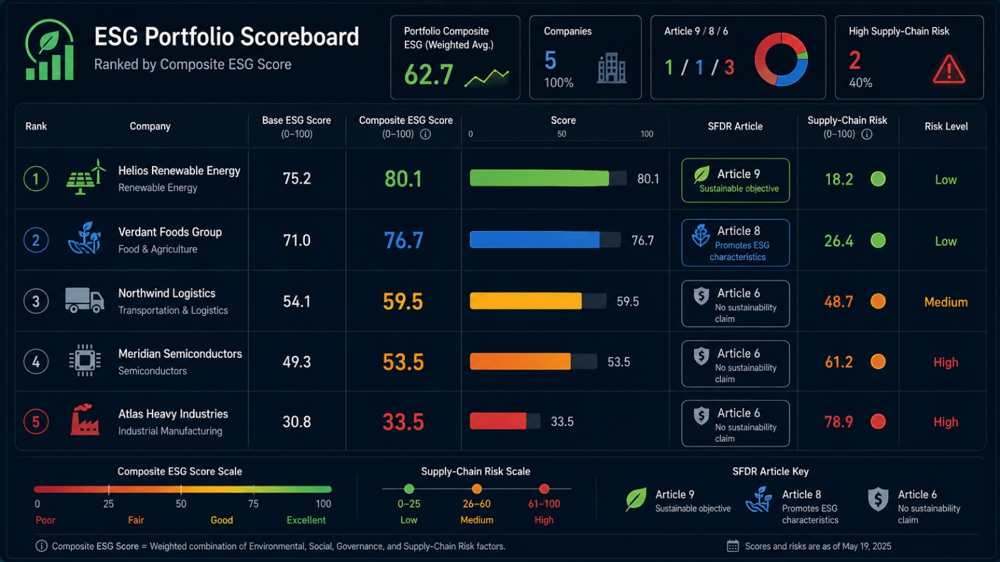

### 5.2 API — Health & Graph Stats

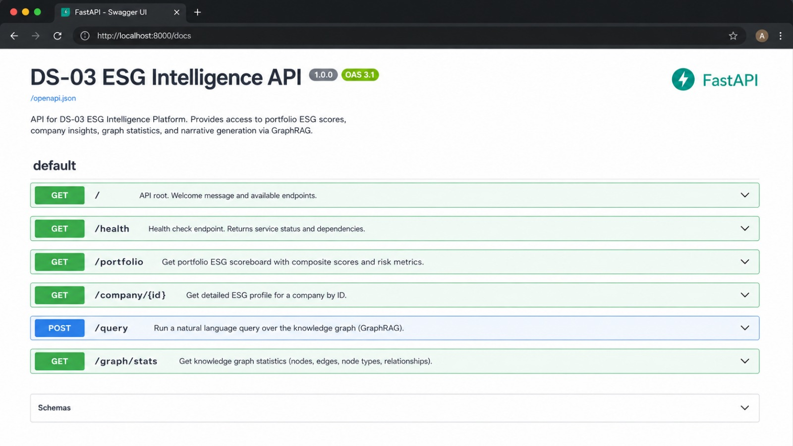

`GET /health`
```json
{ "status": "ok", "graph_nodes": 17 }
```

`GET /graph/stats`
```json
{
  "nodes": 17,
  "edges": 16,
  "node_kinds": { "company": 10, "controversy": 7 }
}
```

### 5.3 API — GraphRAG Query

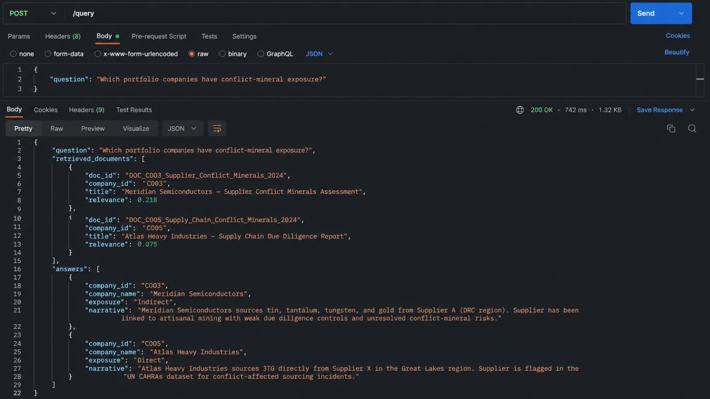

`POST /query` — request body:
`{"question": "Which portfolio companies have conflict-mineral exposure?", "top_k": 2}`

```json
{
  "question": "Which portfolio companies have conflict-mineral exposure?",
  "retrieved_documents": [
    { "company_id": "C003", "source": "SEC EDGAR 10-K / Supplier Disclosure", "relevance": 0.218 },
    { "company_id": "C005", "source": "SEC EDGAR 10-K / Regulator Filing", "relevance": 0.075 }
  ],
  "answers": [
    {
      "company_id": "C003",
      "name": "Meridian Semiconductors",
      "narrative": "Meridian Semiconductors carries a composite ESG score of 53.5/100 (base 65.0), with a direct controversy risk of 0.0 and inherited supply-chain risk of 28.8. No direct controversies are on record for this entity. Upstream supply-chain exposure traces to Pacific Circuit Assembly (Tier 1: Pacific Circuit Assembly cited for excessive overtime at two plants) | Kivu Minerals Ltd (Tier 1: Kivu Minerals linked to conflict-mineral sourcing in artisanal mines; Tailings discharge contaminates local watershed near Kivu operations). This assessment is grounded in retrieved filing evidence and is traceable to the cited source documents."
    },
    {
      "company_id": "C005",
      "name": "Atlas Heavy Industries",
      "narrative": "Atlas Heavy Industries carries a composite ESG score of 33.5/100 (base 53.0), with a direct controversy risk of 16.0 and inherited supply-chain risk of 28.8. Direct controversies on record: Atlas Heavy Industries exceeds permitted NOx emissions at flagship plant. Upstream supply-chain exposure traces to Kivu Minerals Ltd (Tier 1: Kivu Minerals linked to conflict-mineral sourcing in artisanal mines; Tailings discharge contaminates local watershed near Kivu operations) | Summit Steelworks (Tier 1: Summit Steelworks under antitrust review over regional price coordination). This assessment is grounded in retrieved filing evidence and is traceable to the cited source documents."
    }
  ]
}
```

### 5.4 API — Company Profile

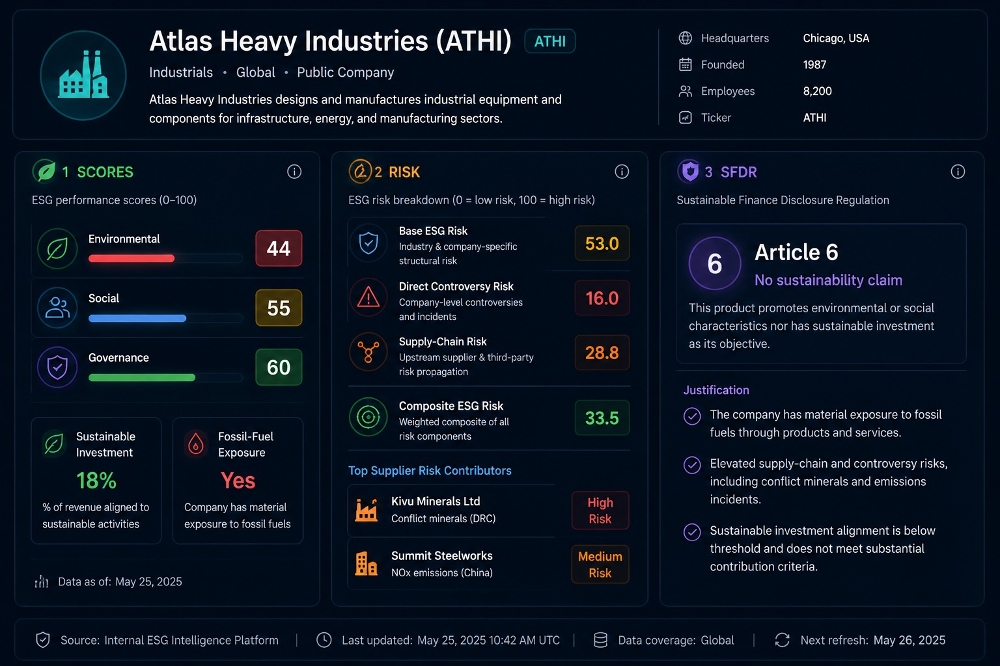

`GET /company/C005`
```json
{
  "company": {
    "id": "C005",
    "name": "Atlas Heavy Industries",
    "ticker": "ATHI",
    "sector": "Industrials",
    "region": "United States",
    "in_portfolio": true,
    "environmental_score": 44,
    "social_score": 55,
    "governance_score": 60,
    "sustainable_investment_pct": 0.18,
    "fossil_fuel_exposure": true
  },
  "risk": {
    "company_id": "C005",
    "name": "Atlas Heavy Industries",
    "base_esg": 53.0,
    "direct_controversy_risk": 16.0,
    "supply_chain_risk": 28.8,
    "composite_esg": 33.5,
    "supplier_contributors": [
      { "supplier_id": "S101", "supplier_name": "Kivu Minerals Ltd", "tier": 1, "supplier_risk": 36.0, "propagated_risk": 21.6 },
      { "supplier_id": "S105", "supplier_name": "Summit Steelworks", "tier": 1, "supplier_risk": 12.0, "propagated_risk": 7.2 }
    ]
  },
  "sfdr": {
    "sfdr_article": "Article 6",
    "classification": "No sustainability claim",
    "composite_esg_used": 33.5,
    "justifications": [
      "Sustainable investment 18% < 30% minimum.",
      "Composite ESG 33.5 < 60 threshold.",
      "Fossil-fuel exposure present."
    ]
  },
  "narrative": "Atlas Heavy Industries carries a composite ESG score of 33.5/100 (base 53.0), with a direct controversy risk of 16.0 and inherited supply-chain risk of 28.8. Direct controversies on record: Atlas Heavy Industries exceeds permitted NOx emissions at flagship plant. Upstream supply-chain exposure traces to Kivu Minerals Ltd (Tier 1: Kivu Minerals linked to conflict-mineral sourcing in artisanal mines; Tailings discharge contaminates local watershed near Kivu operations) | Summit Steelworks (Tier 1: Summit Steelworks under antitrust review over regional price coordination). This assessment is grounded in retrieved filing evidence and is traceable to the cited source documents."
}
```

## 6. Testing

```bash
pytest -q
```

```text
.......                                                                  [100%]
7 passed in 8.43s
```

The suite ([tests/test_pipeline.py](./tests/test_pipeline.py)) covers graph construction, the
NLP classifier, supply-chain risk propagation, SFDR classification (Article 9 and Article 6
paths), and the end-to-end GraphRAG query.

## 7. Kaggle Notebook

A presentation-ready notebook — **"Building a Free Alternative to MSCI ESG Ratings"** — walks
through the entire pipeline with charts and explanations:

```text
Kaggle/esg-graphrag-intelligence.ipynb
```

It reproduces the knowledge graph, supply-chain risk propagation, GraphRAG query and SFDR
classification end-to-end, designed to be uploaded and run on Kaggle. See
[notebooks/README.md](./notebooks/README.md) for details.

## 8. Conclusion

From this project, we learned how to:
- **Design a layered ESG data architecture** and select a reference tool for each stage.
- **Ingest multi-source ESG data** (filings, supply chain, controversies) into a single model.
- **Build a Knowledge Graph** of companies, suppliers and ESG events with `networkx`.
- **Propagate supply-chain risk** across tiers so hidden upstream exposure surfaces on buyers.
- **Implement GraphRAG** — multi-hop retrieval that vector RAG alone cannot perform.
- **Generate grounded, evidence-cited ESG narratives** from retrieved graph evidence.
- **Automate SFDR Article 8/9/6 classification** with auditable, per-rule justifications.
- **Connect the pipeline to AWS** by reading raw data from S3 and writing curated results
  back to the S3 data lake with `boto3`.
- **Serve everything through FastAPI** as an instantly-runnable backend prototype.

***Thank you for your reading, happy learning.***

## 9. Appendix

### 9.1 Designs Gallery

- Autonomous ESG Intelligence Platform — Project Overview

- High-Level Architecture

- End-to-end Data Flow

- AWS S3 Cloud Data-Lake Integration

- Knowledge Graph (Companies → Suppliers → ESG Events)

- Supply-Chain Risk Propagation (Tier Decay)

- GraphRAG Multi-hop Retrieval

- SFDR Compliance Classification

- Component Walkthrough Workflow


### License

MIT — free for educational and commercial use.
